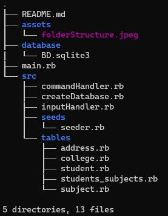
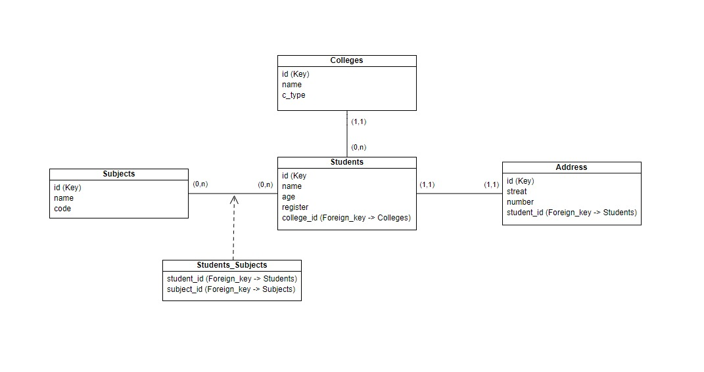

# Trabalho 2 de Programação Web

Interface de acesso ao banco de dados usando Ruby e ActiveRecord

## Estrutura de pastas

- **assets**: Aqui temos as imagens do projeto;
- **database**: Aqui temos o arquivo do database gerado pelo ActiveRecord;
- **main**: Seção principal de execução do código, é aqui que executamos;
- **src**: Aqui temos o código fonte de todo o projeto, separado em:
    - **commandHandler**: Seção que cuida do tratamento do comando do usuário após o input;
    - **createDatabase**: Seção que cria o banco de dados do projeto;
    - **inputHandler**: Seção que faz o tratamento inicial do input do usuário;
    - **seeds**: Pasta contendo o seeder do banco de dados do projeto;
    - **tables**: pasta contendo os models das tabelas do banco de dados.

## Diagrama de classes

O projeto é composto por 4 principais classes, sendo elas:
- Adresses;
- Colleges;
- Students;
- Subjects;

além disso, possui a tabela auxiliar da relação N:N chamada students_subjects.

### Diagrama UML

No banco possuímos as seguintes relações:
- (1,n) entre Colleges e Students;
- (1,1) entre Students e Addresses;
- (n,n) entre Students e Subjects;

## Executando o projeto

Ao acessar a pasta principal do projeto, para executa-lo basta digitar "ruby main.rb" em seu terminal. Após isso, o projeto verificara se o banco de dados já foi criado, caso não, irá cria-lo do zero. Por fim, o seeder é executado, criando as informações caso ainda não existam, e a tela inicial do projeto será exibida.

### Comandos
OBS: O projeto é case sensitive, logo tome cuidado com as cases =D.

Todos os comando seguem um padrão de escrita, caso você insira um comando fora deste padrão ele será rejeitado.

< operação > < tabela > { atributo = valor }

onde:
- < operação > pode ser "insere", "altera", "exclui", "lista";
- < tabela > indica o nome da tabela (addresses, colleges, students, subjects, students_subjects);
- atributo = valor indica o valor do atributo envolvido na operação (0..n valores);
- {...} indica repetição, os colchetes não devem ser adicionados.

Logo abaixo temos alguns detalhamentos das funções.

#### Lista
Ao executar, por exemplo "lista colleges", todas as informações relacionadas as faculdades que estão no banco serão exibidas, adentrando (em um efeito de cascata) nas relações existentes.

OBS: Não existe maneira de realizar uma comando de "lista" com filtros.

#### Insere
Ao executar um comando de inserção, a presença de todas os campos é obrigatória, caso algum esteja faltando a inserção não será realizada.

Um caso especifico é para a relação (n,n) entre Students e Subjects, para adicionar uma nova relação entre estas duas tabelas, é necessário realizar uma inserção na tabela de students_subjects por meio do comando:

insere students_subjects student_id="id" subject_id="id".

#### Altera
Ao executar o comando de alteração, caso o retorno da pesquisa seja mais de um item, uma nova seção será exibida, pedindo para informar qual das tuplas você deseja alterar. Após selecionar a tupla, será pedido para você informar os valores que pretende atualizar, o comportamento e o padrão são os mesmo que numa inserção, mas neste caso informe apenas os valores.

OBS: Só é possível informar um valor de "filtro" para a alteração. 

#### Exclui
Ao executar o comando de exclusão, caso o retorno da pesquisa seja mais de um item, uma nova seção será exibida, pedindo para informar qual das tuplas você deseja excluir, ou se deseja excluir todas as que forem exibidas. Após selecionar a tupla, a exclusão ira ser realizada

OBS: Só é possível informar um valor de "filtro" para a exclusão.